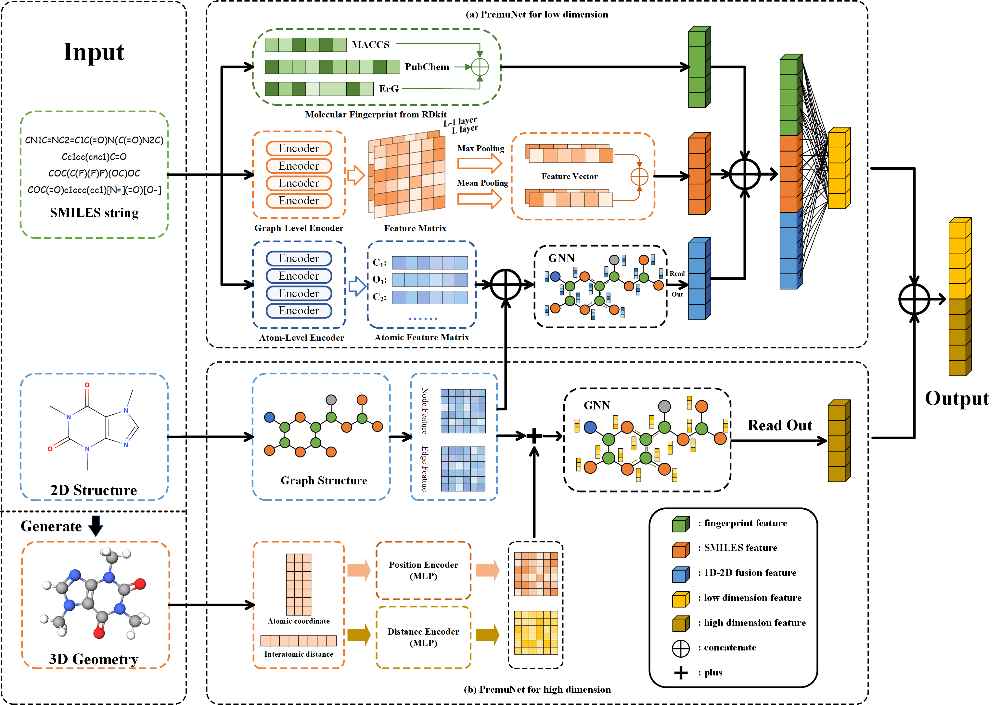

# A Pretrained Multi-Representation Network for Molecular Property Prediction
### [Paper]() | [Github]() | [ArXiv]()

## OverView

PremuNet can extract information from multiple views and combine them interactively through pre-training and fine-tuning. The network consists of two branches: a Transformer-GNN branch that extracts SMILES and graph information, and a Fusion Net branch that extracts graph and conformation information, called PermuNet-L and PermuNet-H respectively. We employ masked self-supervised methods to enable the model to learn information fusion and achieve improved performance in downstream tasks.
<div align="center">

</div>

## Dataset
### Dataset for pretraining.
Our pre-training process employs both the ChEMBL and PCQM4M datasets. The ChEMBL dataset can be accessed through [this link](https://chembl.gitbook.io/chembl-interface-documentation/downloads), while the PCQM4M dataset is available for download [here](http://ogb-data.stanford.edu/data/lsc/pcqm4m-v2-train.sdf.tar.gz).
### Dataset for finetune
We use MoleculeNet as our benchmark test. The datasets and splits of MoleculeNet in our experiment are available at [this link](http://snap.stanford.edu/ogb/data/graphproppred/csv_mol_download/)
We have added 3D coordinates to the molecules in MoleculeNet to further improve prediction performance.The source for these 3D coordinates can be accessed via [here](https://github.com/learningmatter-mit/geom).
## Setup Environment
```shell
pip install -r requirements.txt
```
## Pretrain
The pretraining weights can be found at [this link](https://drive.google.com/drive/folders/16ANfFYW4uKYrBzn56v94hkAGu4yGg7tM?usp=share_link).
Please download them and put them in the `/model_weight` directory.
### SMILES-Transformer
#### For Atom-Level Pretrain
To pretrain the Atome-Level Transformer, you can follow these steps:
```shell
cd Transformer1D
python pretrain_trfm.py
```
#### For Graph-Level Pretrain
The pre-training of Graph-Level Transformer can follow the introduction in [this link](https://github.com/DSPsleeporg/smiles-transformer).
### PremuNet-H
PremuNet-H module, we used the code from [this link](https://github.com/teslacool/UnifiedMolPretrain), and the pre-training process can be completed according to their instructions.
We provide the weights trained by us, which can be downloaded [here]().
## Finetuning
The configuration files for each dataset are located in the /configs directory. These parameters can be utilized directly as provided, or they can be modified as needed. The step for finetuning on MoleculeNet is as follows
### Step 1: Download Dataset
You should unzip the downloaded dataset and place them separately under the `/dataset/` directory.
### Step 2: Get Molecular Feature
```shell
python pretrans_data.py
```
### Step 3: Start finetuning
```shell
bash evaluate_all.sh
```

## Cite
The formal citation format will be added after the publication of the paper.

## Reference
This project utilizes the code from the [UnifiedMolPretrain](https://github.com/teslacool/UnifiedMolPretrain) and [Smiles-Transformer](https://github.com/DSPsleeporg/smiles-transformer) projects. The successful implementation of this project is attributed to the outstanding research papers and well-structured code provided by these initiatives.
